### Motivation

.pull-left[
- How does interaction with elite peers affect performance?

 - Referred as "spillover effects" or "peer effects"

 - Analyzed in many settings: sports, classrooms, innovators, ...

- Estimating spillover effects is difficult because of

 - non-random selection into treatment

 - agents respond to other incentives

- We analyze spillovers by

 - using Europan football as labaratory 

 - by relying on a quasi-experimental design

]

.pull-right[

 
Source: The New Yorker 

]
---
### Research Question:

 

 How much does interaction with elite peers affect performance? 

--
.left[
 More specifically: 
]

 How much does playing in UEFA Champions League affect team performance in domestic leagues? 

---
### Empirical Strategy
 

- Each season a few teams are eligible to play in the UEFA Champions League (UCL)

- This leads to a discontinuity in exposure to elite peers

- We exploit this discontinuity to analyze spillover effects

--

- The *causal effect of UCL* is about

 - +10 pecentage points increase in probability of winning a game

 - +0.3 goal difference per game on average

---

class: inverse, center, middle
name: Data

# Data

<html>

</html>

---
### Data Description

 

- A new data set of European football at the game level, including actual result, location, betting market odds, end of league tables, transfer fees.
   

- *Top Five* European countries: England, Germany, Italy, Spain, and France
 

- Information on the universe of football games for the period 2000-2020
 

- We pool data across countries and seasons into a single sample
 

---
### Measures of Performance

 

 

- At the match level:

 - Goal difference (Ex-Post): the number of goals scored minus the number of goals conceded

 - Probality margin (Ex-ante): betting market determined probility of winning minus the probability of losing

- We conduct analysis using both measures

 - Focus on the probability margin in this presentation

---
 
### *(Ex-Ante)* Measure of Performance: [Probability Margin](#pm-detail)

- We use kick-off odds on football matches from 13 major online bookmakers: Bet365, BWin, ...

- From the odds, we calculate *ex-ante* probability of different events

- Probability margin of winning (PM), defined as probability of winning minus probability of loosing

#### Example

|	Date | 	Home Team |	Away Team |	B365 Away |	B365 Draw| 	B365 Home  |	Score |
| :---: | :---: | :---: | :---: | :---: | :---: | :---: | :---: | :---: | :---: |
|06/05/18 	|Barcelona |	Real Madrid |	4.50 |	4.33 |	1.66 |	2-2|

**Probabilities**

| Barcelona winning | Real Madrid Winning | Draw |
|:---:              | :---:               | :---: |
| 57%             | 21%               | 22% |

**Probability margin**

- $PM_{Bar,Mad,H,ESP,2018} = 57-21=36\%, \quad \quad$ $PM_{Mad,Bar,A,ESP,2018} = 21-57=-36\%$

---
name: uefa
### UEFA Champions League 

.pull-left[

- UCL is an annual club football competition organized by UEFA

- UCL is the most prestigious club competition in European football, contested by 32 clubs 

- Players are exposed to better quality peers in UCL

- The clubs that played in the 2018/19 UCL have shared about &euro;2 bn in payments from UEFA

- Plus matchday revenues, sponsorship deals, bargaining power in the transfer market, etc

]

.pull-right[
 

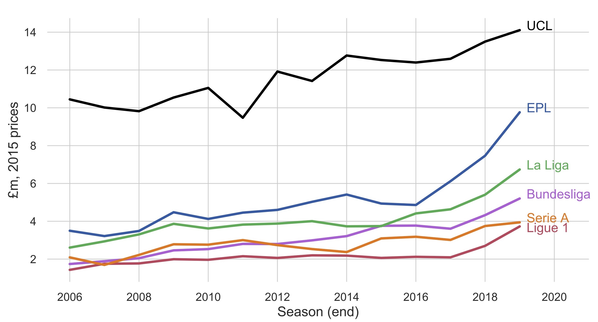
 
Source: www.transfermarkt.co.uk

]

---
.pull-left[
### UCL Qualification

- Consider a national league with $N$ teams in season $t$

- Each team plays two matches against each opponent

- Outcome of each match is decided based on goal difference (GD)

- A positive GD indicates win (3 points), zero draw (1 point), and negative loss (0 point)

- Position is based on the total number of points at the end of season 

- Each league has a UEFA allocated quota for UCL
]

.pull-right[

<h4> UCL Qualification Example: EPL (2014-15) </h4>
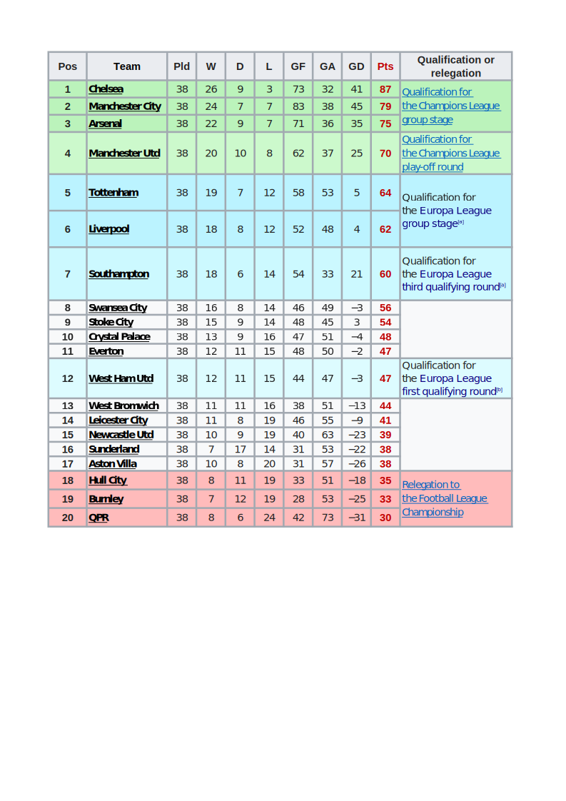

]

---
### Eligibility vs Participation

.pull-left[
- The eligibility is a deterministic function of the number of points
\begin{equation*}
\text{Elig}_{i,l,t} = 1(\text{Pts}_{i,l,t} \geq \text{Pts}^*_{l,t}),
\end{equation*}
where $(\text{Pts}^*_{l,t})$ is the **country-season specific threshold**, defined as average points of the best ineligible team and worst eligible team

- Eligibility does not gurantee playing in the UCL

 - Some teams need to play qualifying games
 
- Non-eligible teams can still play in the UCL

 - For example, by winning Europa League
 
- Hence, fuzzy regression discontinuity design
 ]
--
.pull-right[

<h4> Share of Teams Participated in the UCL  </h4>
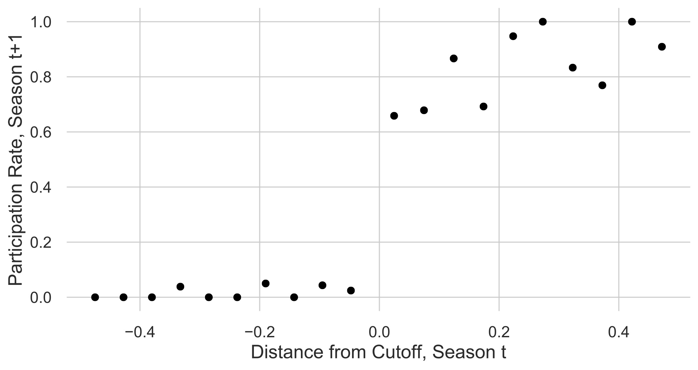

.center[*Participation in the UCL group stage.
The sample includes teams from top 5 European countries (2000-2020), near the threshold.*]
]

---

### Empirical Strategy
 

- Estimate model parameters using fuzzy regression discontinuity design (RDD)

- We estimate variants of the following regression model
\begin{equation*}
Y_{i,j,h,l,t+1} = \gamma_0 + \gamma_1 \text{UCL}_{i,l,t} + f(S_{i,l,t}) + \nu_{i,l,t+1},
\end{equation*}
where $S_{i,l,t} \equiv \frac{Pts_{i,l,t}-Pts^*_{l,t}}{Std(Pts_{i,l,t})}$ is the centered points

 - $\text{Elig}_{i,l,t}$ is an instrument for $\text{UCL}_{i,l,t}$

 - We assume that $f(.)$ can be described by low-order polynomial
 

---
### [RD Validity Checks](#validity)

 

 

- No discontinuity on the disribution of the running variable 

- No discontinuity on the predetermined variables
---
class: inverse, center, middle
name: empirics

# Empirical Results

<html>

</html>

---
### Discontinuity in the [Prob. Margin of Winning (t+1)](#gd)

.pull-left[

<h4> Prob. Margin of Winning After Qualification </h4>  
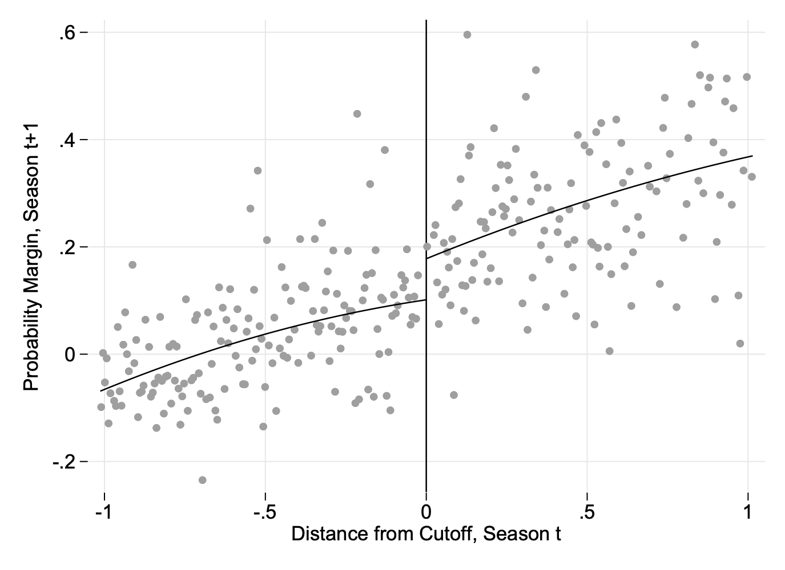

.center[*Discontinuity in subsequent probability margin of winning based on quadratic regression.*]

]

.pull-right[

<h4> RDD Estimates </h4> 

|Specification| (1)   | (2)   |  (3)  | (4)   |
|---          | :---: | :---: | :---: | :---: |
|Estimate     |  $0.100^{***}$| $0.116^{***}$  |  $0.103^{***}$ |  $0.111^{***}$|
|Std. Error   |   0.035  |  0.041   |0.030 |0.036 |
|Pol. Order   |  1  | 2 | 1 | 2 |
|Method    | Robust  | Robust |Conven.| Conven.|
|Eff. Sample Size     |  16,544   | 27,827  |  16,544    |  27,827 |

**Notes:** _Estimates are based on a MSE-optimal bandwidth and triangular kernel. All specifications include a season and league fixed effects. Estimated standard errors are two-way clustered at the team-season levels. $^{***}$ Significant at the 1 percent level. $^{**}$ Significant at the 5 percent level. $^{*}$ Significant at the 10 percent level._

]

---
class: inverse, center, middle
name: mechanisms

# Mechanisms

<html>

</html>
---
### Mechanisms through which UCL affects performance

- Money and prestige

 - Hire better managers
 
 - Hire better players
 
- Spillover effects

 - Players takes training sessions more seriously to be able to compete in UCL
 
 - Translates into physical fitness and tactical discipline 
 
 - Helps in domestic games
 
 - Learning from elite players

- We rule out the former, and argue for the latter channel

 - Run the same results with teams that did not change their managers in the previous summer
 
 - Look at the transfer fees of incoming and outgoing players
---
### Still significant on teams with no managerial changes

.pull-left[

<h4> Prob. Margin of Winning After Qualification </h4>  

.center[*Discontinuity in subsequent probability margin of winning based on quadratic regression.*]
]

.pull-right[

<h4> RDD Estimates </h4> 

|Specification| (1)   | (2)   | 
|---          | :---: | :---: |
|Estimate     |  $0.1^{**}$ | $0.1^{**}$  | 
|Std. Error   |  0.05  | 0.044|
|Pol. Order   |  2  | 2 |
|Method    | Robust  | Conven. |
|Eff. Sample Size     |   17,711  | 17,711| 

**Notes:** _Estimates are based on a MSE-optimal bandwidth and triangular kernel. All specifications include a season and league fixed effects. Estimated standard errors are two-way clustered at the team-season levels. $^{***}$ Significant at the 1 percent level. $^{**}$ Significant at the 5 percent level. $^{*}$ Significant at the 10 percent level._
]
---
### No discontinuity on transfer fees

.pull-left[

<h4> Transfer Fees After Qualification </h4>  
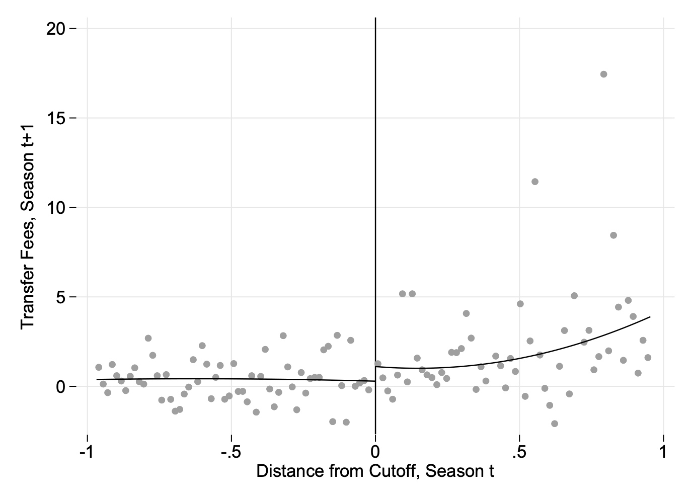

.center[*Discontinuity in transfer fees based on quadratic regression.*]
]

.pull-right[

<h4> RDD Estimates of Transfer Fees After Qualification </h4>  

|Specification| (1)   | (2)   | 
|---          | :---: | :---: |
|Estimate     |  1.62 | 1.22  | 
|Std. Error   |  1.148  | 1.013|
|Pol. Order   |  2  | 2 |
|Method    | Robust  | Conven. |
|Eff. Sample Size     |   7,100  | 7,100| 

**Notes:** _Estimates are based on a MSE-optimal bandwidth and triangular kernel. All specifications include a season and league fixed effects. Estimated standard errors are two-way clustered at the team-season levels. $^{***}$ Significant at the 1 percent level. $^{**}$ Significant at the 5 percent level. $^{*}$ Significant at the 10 percent level._
]

---
class: inverse, center, middle
name: Conclusions

# Conclusion

<html>

</html>

---
### Conclusion
 
 

- Playing in the UCL improves subsequent performance by 10 percentage points in prob. margin of winning a game and 0.3 goals 

- The improvement is large, statistically significant, and robust across different specifications

- By ruling out the money channel, we argue that spillover effects is the main channel.

 - Players take their training sessions more seriously and gain physical fitness and tactical discipline
 
 - Learning from other elite players

---

class: inverse, center, middle
name: Thank You

# Thank You! 

<html>

</html>

---
name: pm-detail
### Step 1: Odds to Probability

|	Date | 	Home Team |	Away Team |	B365 Away |	B365 Draw| 	B365 Home  |	Score |
| :---: | :---: | :---: | :---: | :---: | :---: | :---: | :---: | :---: | :---: |
|06/05/18 	|Barcelona |	Real Madrid |	4.50 |	4.33 |	1.66 |	2-2|

 

\begin{equation*}
\text{Implied probability} = \frac{1}{\text{Decimal odds}} \times 100
\end{equation*}

  

\begin{gather*}
p_h = \frac{1}{o_h} \times 100 = \frac{1}{1.66} \times 100 = 60.2\%\\
p_d = \frac{1}{o_d} \times 100 = \frac{1}{4.33} \times 100 = 23.1\%\\
p_a = \frac{1}{o_a} \times 100 =  \frac{1}{4.50} \times 100 =22.2\%
\end{gather*}

---
### Step 2: Fair Probability

 

.pull-left[
- Normalize probabilities:

 - $p^*_h = \frac{p_h}{p_h+p_d+p_a}$
 
 - $p^*_d = \frac{p_d}{p_h+p_d+p_a}$
 
 - $p^*_a = \frac{p_a}{p_h+p_d+p_a}$
  ]

.pull-right[
- In our example
 - $p^*_h = \frac{60.2}{105.6}= 57\%,\; (p_h = 60.2\%)$
 
 - $p^*_d = \frac{23.1}{105.6}=21.9\%,\; (p_d = 23.1\%)$
 
 - $p^*_a = \frac{22.2}{105.6}=21\%,\; (p_a = 22.2\%)$
]
 

---
### Step 3: [Probability Margin](#uefa)

- The difference between team $i$ winning probability and team $j$ winning probaility
\begin{equation*}
PM_{i,j,l,c,t} = p^*_{i,l,c,t}- p^*_{j,l,c,t}, \; \text{ for all } i \neq j
\end{equation*}
where $i$ is the team, $l \in \{Home\text{ or } Away \}$, $c$ is the country, and $t$ is the season

--
 

### Example
|	Date | 	Home Team |	Away Team |	B365 Away |	B365 Draw| 	B365 Home  |	Score |
| :---: | :---: | :---: | :---: | :---: | :---: | :---: | :---: | :---: | :---: |
|06/05/18 	|Barcelona |	Real Madrid |	4.50 |	4.33 |	1.66 |	2-2|

 

.pull-left[
- $p^*_h = 57\%$
- $p^*_d = 21.9\%$
- $p^*_a = 21\%$ 
]

.pull-right[
- $PM_{Bar,Mad,H,ESP,2018} = 57-21=36\%$

- $PM_{Mad,Bar,A,ESP,2018} = 21-57=-36\%$
]

---

### Predictions vs Realizations

<h4> Probability of Different Events vs Actual Outcomes </h4>  
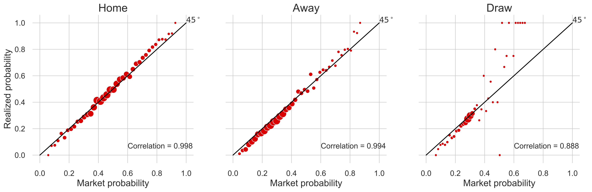

.center[*Market Probability is the probability that the market predicts a team will beat the other team (Home or Away team winning probabilities) or the game will result in a draw, and Actual Probability refers to actual success rate.*]

---
name: validity
class: inverse, center, middle

### RD Validity Checks

<html>

</html>

---
### No discontinuity on the disribution of the running variable 

<h4> Density of Running Variable </h4>  
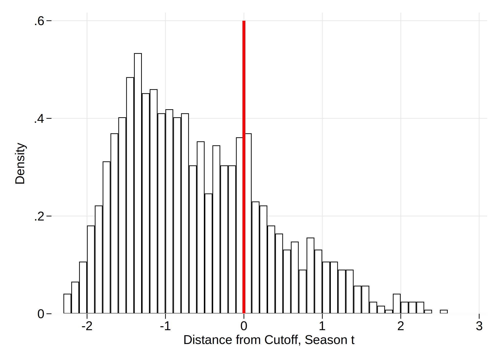

.center[*Density of the running variable with bins of width 0.1   and corresponding Cattaneo, Jansson and Ma (2019) test statistic = 0.303 ( _p_-value=0.762).*]

---
### No discontinuity on the predetermined variables
.pull-left[

<h4> Probability Margin of Winning Before Qualification </h4>  
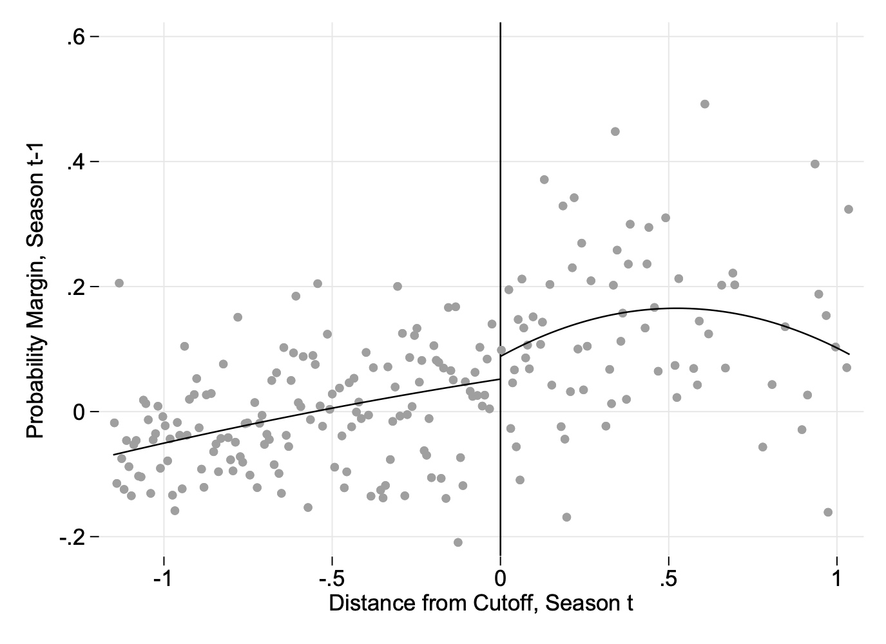

.center[*Discontinuity in probability margin of winning in season t-1, based on quadratic regression.*]
]

.pull-right[

<h4> RDD Estimates  </h4> 

|Specification| (1)   | (2)   |  (3)  | (4)   |
|---          | :---: | :---: | :---: | :---: |
|Estimate     |  0.058  | 0.045   |  $0.076^*$ |   0.060  |
|Std. Error   |    0.047   |  0.058    |0.040   | 0.051 |
|Pol. Order   |  1  | 2 | 1 | 2 |
|Method    | Robust  | Robust |Conven.| Conven.|
|Eff. Sample Size     |   14,097    |21,610   |  14,097     |  21,610   |

**Notes:** _Estimates are based on a MSE-optimal bandwidth and triangular kernel. All specifications include a season and league fixed effects. Estimated standard errors are two-way clustered at the team-season levels. $^{***}$ Significant at the 1 percent level. $^{**}$ Significant at the 5 percent level. $^{*}$ Significant at the 10 percent level._
]

---
### [No discontinuity on the predetermined goal differences](#empirics)
.pull-left[

<h4> Goal Difference Before Qualification </h4>  
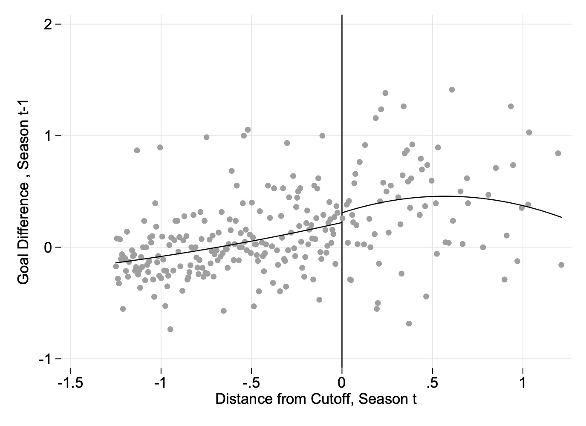

.center[*Discontinuity in goal difference in season t-1, based on quadratic regression.*]

]

.pull-right[

<h4> RDD Estimates of Goal Difference Before Qualification </h4>  

|Specification| (1)   | (2)   |  (3)  | (4)   |
|---          | :---: | :---: | :---: | :---: |
|Estimate     |  0.169 |  0.116  |  $0.223^*$ |  0.163  |
|Std. Error   |   0.150   |  0.175     |0.130   | 0.157 |
|Pol. Order   |  1  | 2 | 1 | 2 |
|Method    | Robust  | Robust |Conven.| Conven.|
|Eff. Sample Size     |  14,097    |23,766 |  14,097     |  23,766  |

**Notes:** _All specifications include a season and league fixed effects. Estimated standard errors are two-way clustered at the team-season levels. $^{***}$ Significant at the 1 percent level. $^{**}$ Significant at the 5 percent level. $^{*}$ Significant at the 10 percent level._

]
---
name: gd
### Discontinuity in the [Goal Difference (t+1)](#mechanisms)

.pull-left[

<h4> Goal Difference After Qualification </h4>  
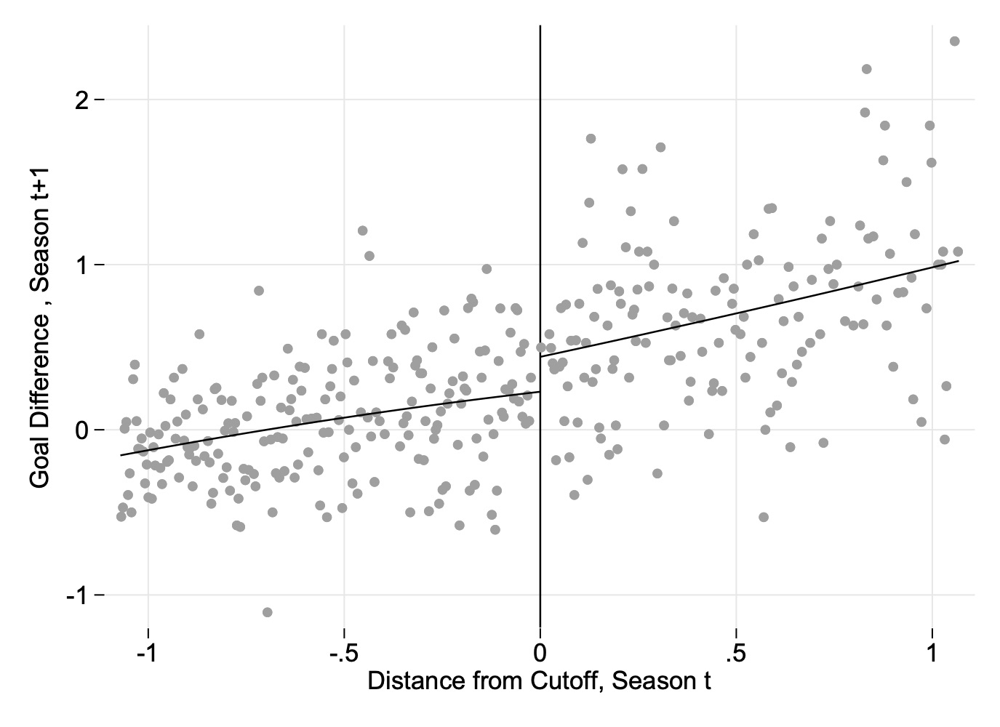

.center[*Discontinuity in subsequent goal difference based on quadratic regression.*]
]

.pull-right[

<h4> RDD Estimates of Goal Difference After Qualification </h4>  

|Specification| (1)   | (2)   |  (3)  | (4)   |
|---          | :---: | :---: | :---: | :---: |
|Estimate     |  $0.290^{**}$| $0.314^{**}$ | $0.292^{***}$ | $0.312^{**}$|
|Std. Error   |  0.123 |  0.150  |0.107  | 0.136 |
|Pol. Order   |  1  | 2 | 1 | 2 |
|Method    | Robust  | Robust |Conven.| Conven.|
|Eff. Sample Size     |   20,281  | 29,231|  20,281  | 29,231|

**Notes:** _Estimates are based on a MSE-optimal bandwidth and triangular kernel. All specifications include a season and league fixed effects. Estimated standard errors are two-way clustered at the team-season levels. $^{***}$ Significant at the 1 percent level. $^{**}$ Significant at the 5 percent level. $^{*}$ Significant at the 10 percent level._
]
---
### No managerial changes

.pull-left[

<h4> Goal Difference After Qualification </h4>  
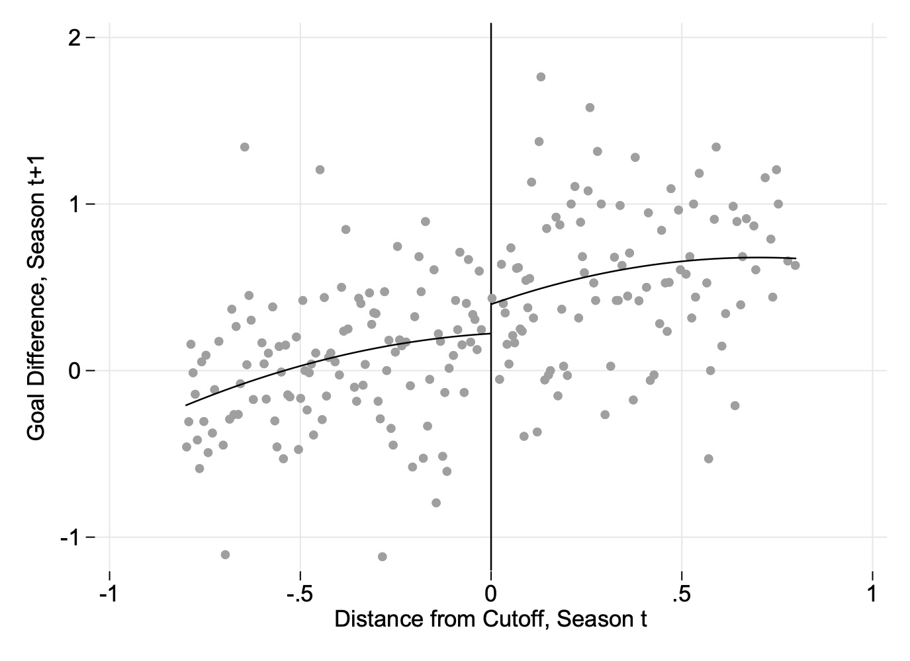

.center[*Discontinuity in subsequent goal difference based on quadratic regression and a bandwidth of 10.*]
]

.pull-right[

<h4> RDD Estimates </h4> 

|Specification| (1)   | (2)   | 
|---          | :---: | :---: |
|Estimate     |  $0.34^{*}$ | $0.302^{*}$  | 
|Std. Error   |  0.2  | 0.181|
|Pol. Order   |  2  | 2 |
|Method    | Robust  | Conven. |
|Eff. Sample Size     |   15,809  | 17,809| 

**Notes:** _Estimates are based on a MSE-optimal bandwidth and triangular kernel. All specifications include a season and league fixed effects. Estimated standard errors are two-way clustered at the team-season levels. $^{***}$ Significant at the 1 percent level. $^{**}$ Significant at the 5 percent level. $^{*}$ Significant at the 10 percent level._
]

